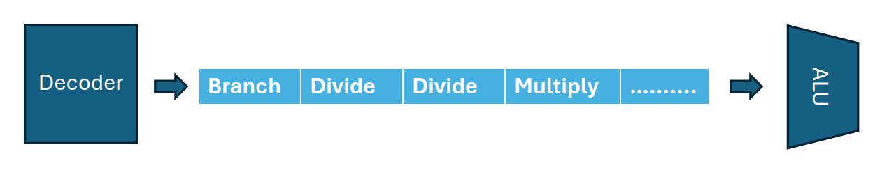
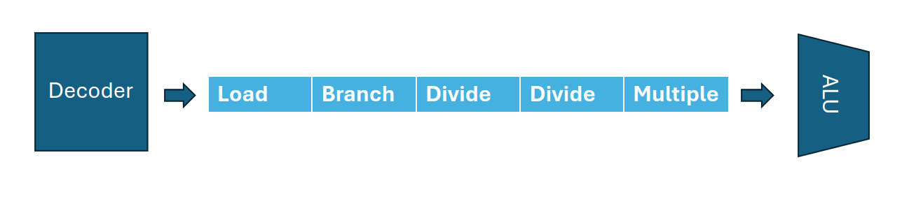
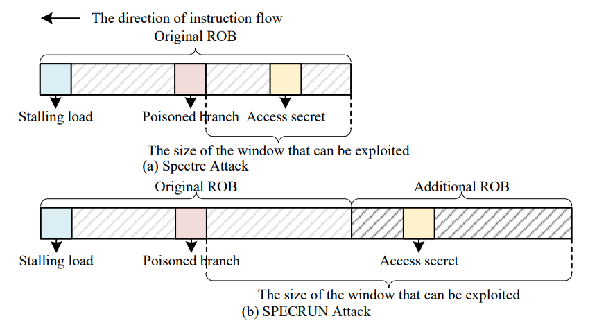
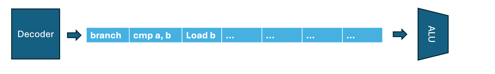
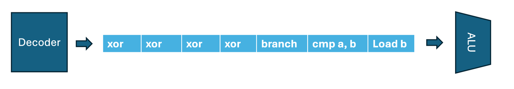

# Consideration about the experiments 
I will explain the questions about how to distinguish runahead from architectural/speculation execution, and normal prefetching here. Be aware that I assume we do not trigger DCO in those cases.

Without DCO, denver is an in-order processor.
## Distinguish runahead from architectural execution
If I understand the question correctly, there is one example we concern:

```
load reg1, var1     //var1 is not in the cache, which tends to trigger runahead
...
load reg2, var2     //var2 (also not in the cache) is possible to be fetched to cache in runahead.

```
However, considering about the simple code above, when all the instructions are retired, we are not able to see any differences, because even runahead is not triggered, `var1` and `var2` should be in the cache; thus we are not able to distinguish whether `var2` is fetched by architectural execution or runahead. The core 
issue is both architectural execution and runahead will finally commit the results to register file/memory.

I propose the following methodologies to distinguish runahead from architectural execution.
### Incorrect memory access
We may use fault to stop the processor to commit the result to register file/memory.
After we execute `load reg1, var1`, we trigger a memory access fault, to be more specific, we access memory address `0x00000000` (we are not allowed to access this address), then there should be a segfault signal; as a result, `load reg2, var2` will not be committed to register file/memory. The next step, the program will call signal handler function. In the function, we should be able to check whether `var2` is being fetched into cache.

```
fault_handler_func(){
    we check whether var2 is in the cache in this function.
}

load reg1, var1     //var1 is not in the cache, which tends to trigger runahead
*((volatile char*)0); 
load reg2, var2     //var2 (not in the cache) is possible to be fetched to cache in runahead.
```
### Spectre-v1
In speculation execution, if the program goes to the wrong path (misprediction), we are also able to stop the processor to commit the result, because once the processor find out it goes to the wrong path, it will discard the results and switch to the correct path.

Consider about the following code. At beginning, we train the branch predictor for `if(a < b)` to be always taken, then flush variable `b`, in this case we delay the branch resolver from resolving the branch. At the same time, we trigger runahead. <u>__However, there are some issues: we are not able to know whether speculation brings `var1` to cache, or runahead brings `var1` to cache. I think that is related to the second question, I will discuss this question in the next section.__</u>

```
flush(&b);
// we train the branch at first to trigger misprediction
if(a < b){
    load reg2, var1
}
```
## Distinguish runahead from speculation
This issue actually bothers me for a while. I have not found a way to detect runahead directly though I considered and analyzed about it. This is the part I wanted to discuss more last time we meet, but due to the confusion of the dco writeup, finally we run out of time. 

From the previous experiments, I found runahead's behavior is very similar to speculation execution. But for some details, it may be different with speculation in theory.
### Segfault signal
We use the code in previous section here to discuss why I think that is runahead.

Assumption: <u>__I assume the first `load reg1, var1` will not trigger speculation execution.__</u> The reason for this assumption is: I've never heard a processor will do speculation execution after encountering a long-latency load, and I've never seen any publications do such research except runahead execution(but it does not mean this design does not exist, if this kind of implementation does exist and widely used in modern processors, please point it out, then the following discussion is not valid and I am very wrong).

With the assumption, suppose `load reg2, var2` is not prefetched by runahead, when we execute `load reg1, var1`, without speculation, the only possibility is: the second `load reg2, var2` will be executed in parallel with `load reg1, var1`. However, it will only happen when `load reg1, var1` and `load reg2, var2` are all in the pipeline.
In the following code, right after the invalid memory access operation, I add 100 or more instructions before the second load to make sure those two load operations are not all in the pipeline. 

However, it is better to know about what is the exact size of pipeline.
```
fault_handler_func(){
    we check whether var2 is in the cache in this function.
}

load reg1, var1     //var1 is not in the cache, which tends to trigger runahead
*((volatile char*)0); 
/*The only difference is: 
 *we add some nop, add ... instructions 
 *before the second load
 */
NOPS(100)           //We add some instructions to make sure the second load is not in the pipeline.
load reg2, var2     //var2 (not in the cache) is possible to be fetched to cache in runahead.
```

### Spectre v1
Spectre v1 is much more difficult to distinguish from runahead. `if (a < b)` is a conditional branch, indeed the processor will do speculation execution. I am not sure whether the following experiment is correct, if it is invalid, please point it out.

However, we may design such experiment to see if speculation execution will also fetch `var1` to cache. From the following code, <u>__we do not flush `b`__</u>, however, rather than do `if(a < b)`, we do some very complex arithmetic operations such as multiply, divide etc.

```
// we train the branch at first to trigger misprediction
if(a < b * x / y ...){
    load reg2, var1
}
```

Then what does the pipeline looks like?
At the beginning, `branch` instruction is just shoot to pipeline, and the branch predictor start to decide whether the branch is taken or not. Assume we train the branch predictor previously, it will decide to take the branch.


In the next cycle, the `load` instruction enters the pipeline. However, the branch is not resolved yet; thus, `load` instruction is likely to be executed in parallel since it does not have data dependency with previous instructions.


Experiment result:
If we are not able to see the spectre signal, we can conclude that speculation may not be able to fetch `var1` into cache.

Reasoning and explaining:
Look at the pipeline again. In the example of following figure, we only have two divides and one multiply instruction to execute, then the branch should be resolved. If we do not see the signal, <u>__it is likely the execution time of two divides, one multiply and branch resolving is very short; as a result, `load` does not have enough time to finish(Does that make sense?)__.</u>


Let's consider about runahead again. We still flush `b` at first, however, before `load reg2, var1`, we add 200 or more `nop`, `adds` ..., and make sure the latency of those instructions is larger than a cache-missed `load reg, b`. If my understanding of speculation is correct, `load reg2, var1` will not have enough time to execute in speculation execution, but if we find that the signal still exists, we can conclude that `var1` is prefetched by runahead. Otherwise, the branch is going to be resolved before `load reg2, var1` is entering the pipeline, it should not be executed.
```
flush(&b);
// we train the branch at first to trigger misprediction
if(a < b){
    NOPS(200);
    load reg2, var1
}
```

## More consideration:
In this section, we discuss how to distinguish runahead from speculation execution in spectre v1 again.

<u>__Current issue: it is hard to distinguish because we do not know the size of speculation execution window.__</u> https://arxiv.org/pdf/2312.01832

Let's go back to paper: __SPECRUN: The Danger of Speculative Runahead Execution in
Processors__. The experiment in the paper also utilize spectre-PHT(The code snippet is in Figure 8 in the paper). How did they distinguish runahead from speculation, the answer is that the execution window of speculation is known.

### Description: 
In the following figure, spectre is defined as: accessing secret happens in the ROB (a). 
However in runahead, it happens after ROB (b). 
Why: if the instructions in ROB are not completed, it is still speculation, runahead will not be triggered. Runahead happens only when all instructions in ROB are completed but not retired. If we see an instruction which is not in the ROB brings data to cache, it is definitely caused by runahead execution. Generally, the ROB size is the maximum execution window size for speculation.

We should have this conclusion about this paper: if an instruction which is not in the ROB fetch data to cache, it is runahead, otherwise it is speculation.


### What is our issue?
From previous section, the paper uses ROB to distinguish runahead from speculation, but in Nvidia denver, there is no ROB; thus we are not able to know the execution window size for speculation with the methodology in the paper SPECRUN.

### What is the execution window size for in-order-cpu?
For now, let's forget everything of the two code snippets about how to distinguish runahead from speculation I wrote in previous section. (It may not be suitable, actually it does have issues.)

Considering such question: do we know what is the execution window size for speculation in Nvidia denver(In-order). 

Let's just consider the following code snippet:
There are 100 `xor` instructions in the branch, and they are all data dependent, and have to be executed one by one; thus we do not need to consider about parallel execution in this case.

```
flush(&b);
// we train the branch at first to trigger misprediction
if(a < b){
    @repeat 100
        xor reg1, reg1, 1      // reg1 = reg1 xor 1
    @end repeat
    load reg, var
}
```

Initially, when the branch instruction is decoded, the pipeline should look like the following figure. The `load b` instruction has been decoded, and we know the `load` will be executed somewhere in pipeline, let's assume the `load` operation will be passed to load/store unit at the end of pipeline (It depends on the design, but it doesn't matter for the analysis).


Let's assume the branch predictor decide to take the branch, and after a few cycles, the pipeline should be: 


Here is the question I want to ask:

<u>__We know that in speculation execution, instructions will not retire. In the in-order cpu, do those instructions remain staying in pipeline? For out-of-order cpu, instructions are waiting in the ROB. I don't know what is the case for in-order cpu.__</u>

<u>__If those instructions will not retire, and staying in the pipeline, will the pipeline stall because there is no space in pipeline?__</u> 

If the pipeline stalls, the decoder will not continue decoding instructions. Then, the execution window size for speculation is around the size of pipeline.


