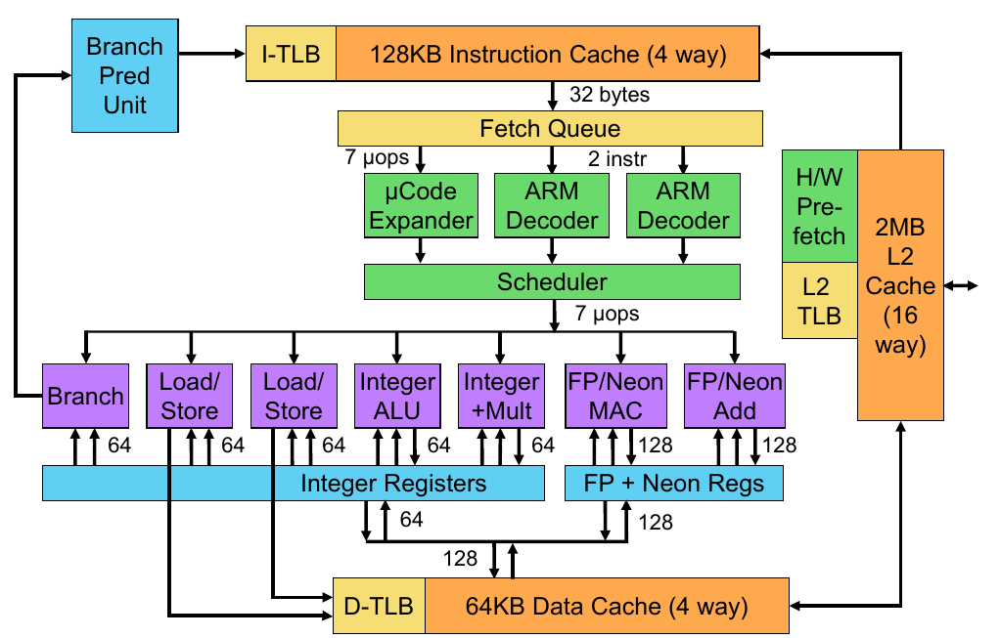

# Measure the instruction window of Denver 2 CPU
## Background and Goal
To distinguish runahead from other forms of speculative execution, I want to determine the size of the speculation instruction window on the Denver 2 processor. Alternatively, I would like to know whether the Denver 2 processor implements a structure similar to a Reorder Buffer (ROB) to store speculative execution results, allowing the processor to achieve a certain degree of out-of-order execution.
## Assumption
We assume that the execution units of the Denver 2 processor have not changed significantly from those of the Denver 1 processor. Specifically, the processor's execution units are still divided into several different units, allowing a certain degree of parallel execution. Floating-point operations (FP NEON units in the figure) and integer operations do not share the same execution unit. Additionally, integer operations are divided into two separate units: one dedicated to basic ALU operations (Integer ALU in the figure) and the other handling multiplication and division (Integer + MULT).


## Experiment design
We measure the latency of four instructions: `fdiv` (floating-point division), `fcvtzs` (converting a floating-point value from an ARM floating-point register to an integer stored in the general-purpose registers x1-x32), `sdiv` (integer division), and `adds` (integer addition). The `fdiv` instruction utilizes the floating-point division unit, while `fcvtzs` might use the integer execution unit (though this is not entirely certain, it does not significantly affect the results). The `sdiv` instruction uses the integer division unit, and `adds` relies on the integer ALU unit. Since these four instructions primarily execute on separate execution units, they do not cause resource conflicts.

```
1. fdiv
2. fcvtzs
3. sdiv
4. adds
```

We conduct two sets of experiments:

1. First set: The four instructions have strong dependencies, meaning they must execute sequentially.
2. Second set: We modify the operands of these instructions so that there are no dependencies. Since these instructions use separate execution units and do not significantly compete for resources, they may execute in parallel, allowing for a certain degree of out-of-order execution.


## Hypothesis
If the instruction latency in both experiments is equal or very close, it suggests that the Denver 2 processor executes instructions in order (at least with an execution window smaller than 4).

If Denver 2 has a larger parallel execution window (ROB size) and these four instructions have no data dependencies, the total execution latency should be 34 cycles—determined by the longest instruction, `fdiv` (34 cycles). The other instructions (`fcvtzs` (5 cycles), `sdiv` (8 cycles), `adds` (1 cycle)) should be able to execute in parallel while fdiv is still running.

## Results and discussion
### Results
First set (with data dependency): 51 cycles.
Second set (without data dependency): 49 cycles.

After multiple experiments, the first group consistently resulted in 51 cycles, while the second group resulted in 49 cycles. The minimal difference in execution time strongly suggests that the Denver 2 processor does not support a large degree of parallel instruction execution and that its instruction execution process is mostly in order.

### 2-cycles-latency difference
The results of the second group are still 2 cycles faster than the first group, which caught my attention. I noticed that in the second group, when there is no data dependency, the `fcvtzs` instruction takes 5 cycles, but in the first group, `fcvtzs` takes 7 cycles. The two-cycle difference between the two groups comes from here.

I made the following speculation and hypothesis regarding this phenomenon: The `fcvtzs` instruction executes in the integer execution unit, while `fdiv` executes in the floating-point unit. It is possible that the result from the floating-point unit cannot be bypassed to the integer execution unit in time, causing `fcvtzs` to wait for two cycles until the result of fdiv is committed. (In the first group, the combined delay of `fdiv` and `fcvtzs` is 41 cycles (34 + 7), but a single `fcvtzs` instruction  takes 5 cycles. If we insert a delay of around 2 cycles between `fdiv` and `fcvtzs`, the total result is still 42 cycles.)


