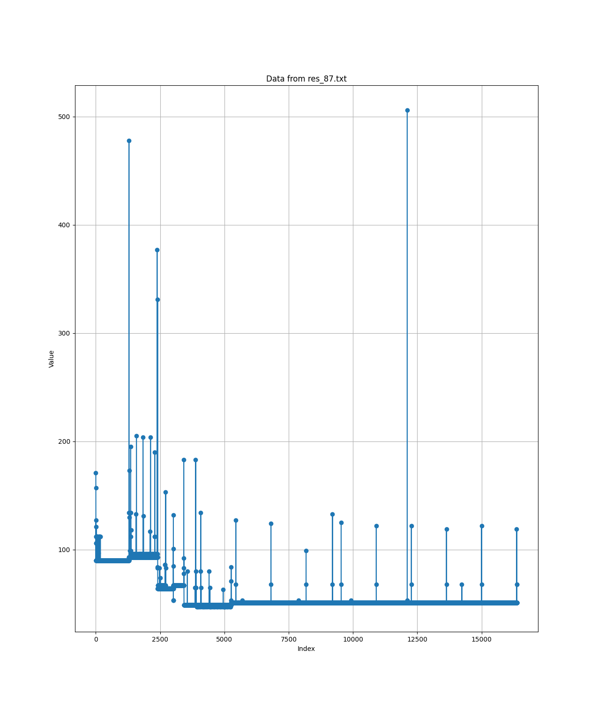
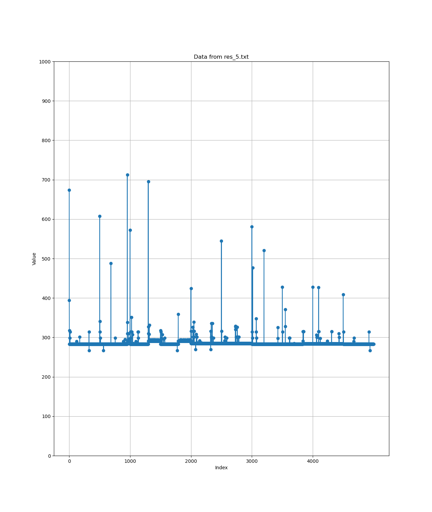
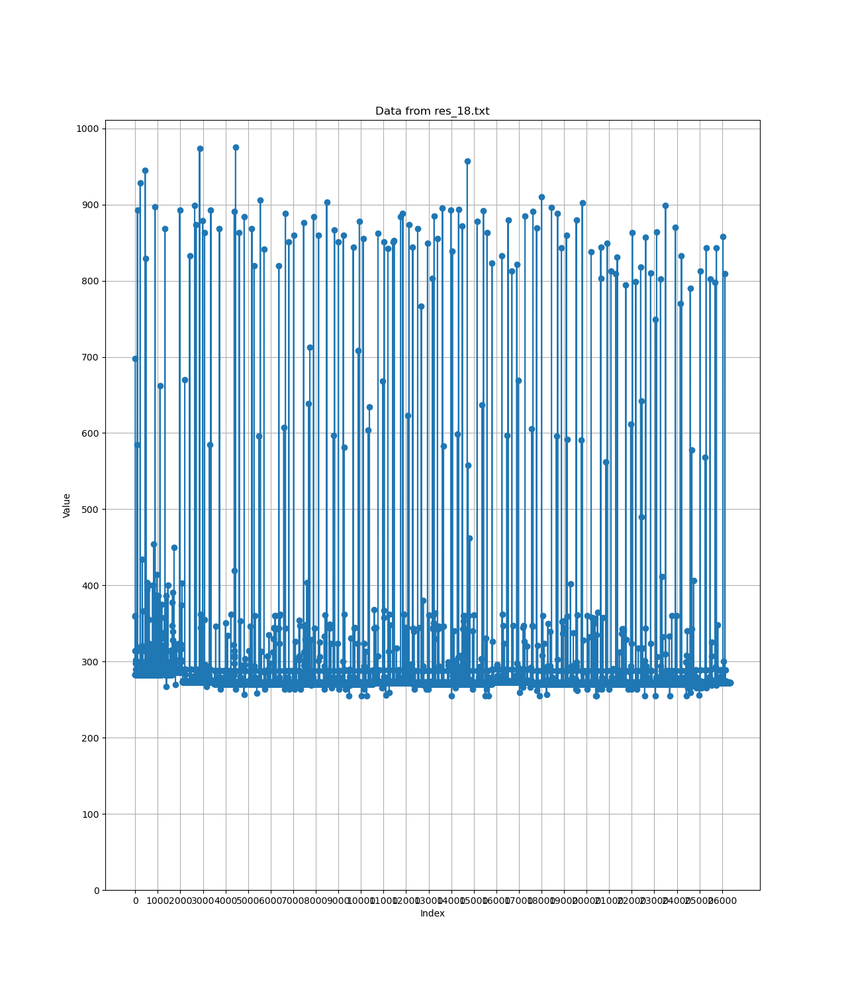

# DCO behavior analysis
## Remove redundant  instructions
### Code and time measurement shown in the figure
For `mov reg, reg`, if we execute it in a loop for multiple times, it will be removed. (`nop` is the same with `mov`).


```
#include <stdio.h>
#include <stdint.h>
#include <sys/mman.h>
#include "utils.h"
#define STRIDE 4096
#define ITER 8192 * 2
#ifndef N
#define N 100 // Default value if not defined in Makefile
#endif
#define NOPS(n) \
     asm volatile( \
        ".rept %0\n" \
        "nop\n" \
        ".endr\n" \
        :: "i" (n) \
   )
 
 #define MOV(n)  \
     asm volatile(   \
         ".rept %0\n" \
         "mov x10, x10\n" \
         ".endr\n"   \
         ::"i" (n): "x10" \
     )
 
 
 int main(){
     volatile uint64_t pick = 0;
     uint64_t init = 0;
     uint64_t end = 0;
     for(int i = 0; i < ITER; i++){
         asm volatile(
             "ldr x1, %[val]\n"
             :
             :[val] "m" (pick)
             : "x1"
         );
         for(volatile int z = 0; z < 100; z++){}
         isb();
         init = get_cycles();
         MOV(N);
         asm volatile(
             "adds x1, x1, #1\n"
             ::: "x1"
         );
         end = get_cycles();
         isb();
         asm volatile(
             "str x1, %[val]\n"
             :
             : [val] "m" (pick)
             : "x1"
         );
         printf("%ld\n", end - init);
     }
 }

```


### Two stages time measurement experiment
It is a way to detect whether DCO kicks in. But how many iterations are required to mark the code as hot region (and then DCO kicks in)? The number of iterations are not fixed. We discussed an experiment to check if we are able to find the fixed number of iterations to trigger DCO:


Hypothesis: We assume the first time when DCO is triggered, it is not stable due to some reason, so the iterations is not fixed.

Experiments:
In a word, we split the iteration into two stages.
```
/*Do stage one time measurement*/
for(;;){
    init = get_cycles();
    MOV(N)              //redundant movs
    adds 
    end = get_cycles(); 

    if((end - init) drops) {  //when the measured time drops, it means DCO is kicking in.
        break;                //if dco kicks in, we break and start the second stage time measurement.
    }
}

/*Do stage two time measurement*/
for(;;){
    ......;                  //We measure time again for redundant movs. If the DCO is stable when it analyzes the code,
                             //it should take somehow fixed iterations.
}
```

Results: Not stable at all. The iterations required to make DCO kick in varies from 1000 to 4000.

## How to avoid DCO
### Avoid using loops
To avoid using loops, we may use loops unrolling in compiler, however, in the Jetson OS, we can only compile with GCC 7 in APT (unable to update to GCC 8, unless we compile GCC manually, maybe do this afterwards), GCC 7 does not support unrolling MACRO.
But can we do it manually? Yes. We are able to use a MACRO to repeat the code.

```

#define REPEAT_10(x) x x x x x x x x x x  //manually repeat code
...
REPEAT_10(measure_time();)
/*Then we have 10 measure_time() function call, rather than using a loop*/
//	measure_time();
//	measure_time();
//	measure_time();
//	measure_time();
//	measure_time();
//	measure_time();
//	measure_time();
//	measure_time();
//	measure_time();
//	measure_time();
```

### Use inline function call
It seems DCO tends to optimize the code in a function (one-function optimization).

```
void func(){}

for(;;)
    func();      //DCO tend to use less iterations to optimize the function.
```

```
void inline func(){}

for(;;)
    func();     //DCO tend to use more iterations to optimize the function.
```

The explanation could be:

In the case of an inline function, the Denver processor's Dynamic Code Optimization (DCO) inserts the code for `func()` directly at the call site. Since each call to `func()` effectively becomes an inlined code segment, DCO observes a significant increase in the code size within the main loop. DCO may need extra time and more iteration cycles to optimize the entire loop body with the repeated `func()` code.

In the non-inline case, DCO only needs to optimize `func()` once, and then every call to `func()` can reuse this optimized version, reducing the amount of code in the main loop that needs to be optimized. As a result, optimizing a non-inline function may complete in fewer iteration cycles.

### Experiments and result in the figure
Hypothesis: When applying the two methodology presented above, we should be able to avoid DCO.

```
#include <stdio.h>
#include <stdint.h>
#include <sys/mman.h>
#include <string.h>
#include "utils.h"

#define MOV(n)	\
	asm volatile(	\
		".rept %0\n" \
		"mov x10, x10\n" \
		".endr\n"	\
		::"i" (n): "x10" \
	)

#define REPEAT_10(x) x x x x x x x x x x

/*An inline function to measure the time*/
static inline __attribute__((always_inline)) void measure_time() {
	uint64_t init;
	uint64_t end;
	volatile uint64_t pick;
	for(int i = 0; i < 50; i++){
		for(int j = 0; j < 10; j++){
		asm volatile(
			"ldr x1, %[val]\n"
			:
			:[val] "m" (pick)
			: "x1"
		);
		for(volatile int z = 0; z < 100; z++){}
        /*MEASURE THE TIME*/
		isb();
        init = get_cycles();		
		MOV(200);
		asm volatile(
			"adds x1, x1, #1\n"
			::: "x1"
		);
        end = get_cycles();
		isb();

		asm volatile(
			"str x1, %[val]\n"
			:
			: [val] "m" (pick)
			: "x1"
		);
        printf("%ld\n", end - init);
		}
	}
}

int main(){
	uint8_t score[5] = {0};
	uint8_t index = 0;
    volatile uint64_t pick = 0;
    uint64_t init = 0;
    uint64_t end = 0;
	REPEAT_10(measure_time();)  //We use repeat MACRO
}

```

As presented in the code above, we repeat time measurement function for 10 time, and within the function, we do 500 measurement (5000 in total). However, DCO is not triggered.



## How about our "Spectre"?
We need to make sure, spectre works, at the same time, DCO does not kick in.

### Code repeat
In fact, I use code repeat in two places, finally, we only use 20 * 10 iterations to do spectre.
```
/*
 * I set a 16 bytes array, without using loop, we can easily repeat it manually.
 */
	REPEAT_16(
		leak(offset + i, &byte);
		leaked[i] = byte;
		i = i + 1;		
	);

```

### Inline function
All of the function with MACRO `static inline __attribute__((always_inline))`.

### Result of spectre
For spectre, it still works.
```
rm -f  ../bin/spectre.o ../bin/spectre
gcc   -g -c spectre.c -o ../bin/spectre.o -I ../include
gcc   -g  ../bin/spectre.o -o ../bin/spectre -I ../include
cache hit: 1, 31
cache hit: 2, 32
cache hit: 3, 33
cache hit: 4, 34
cache hit: 5, 35
cache hit: 7, 37
cache hit: 8, 38
cache hit: 1, 31
cache hit: 2, 32
cache hit: 3, 33
cache hit: 4, 34
cache hit: 5, 35
cache hit: 6, 36
cache hit: 7, 37
cache hit: 8, 38
123457812345678
```

### What about DCO?
I use a simple way to check whether DCO kicks in (May not be a perfect way).

In the previous experiments, we only:
```
REPEAT10(
	for(i = 0 to 50){
		time_measurement();
	}
)
```
```
#define REPEAT_N(x) x x x x x x x x x x
REPEAT16(
	REPEAT20(
		for(i = 0 to 20){
			for(j = 0 to 10){
				train branch predictor
				spectre_v1();
				time_measurement();
			}
		}
	)
)

```
```
static inline __attribute__((always_inline)) void measure_time() {
	uint64_t init;
	uint64_t end;
	volatile uint64_t pick;
	asm volatile(
	"ldr x1, %[val]\n"
	:
	:[val] "m" (pick)
	: "x1"
	);
	for(volatile int z = 0; z < 100; z++){}
	isb();

	init = get_cycles();
	MOV(200);
	asm volatile(
	"adds x1, x1, #1\n"
	::: "x1"
	);
	end = get_cycles();
	isb();

	asm volatile(
	"str x1, %[val]\n"
	:
	: [val] "m" (pick)
	: "x1"
	);
	        printf("%ld\n", end - init);
	}

```

```
static inline __attribute__((always_inline)) void spectre_v1( size_t index) {
	/*
	 * Spectre v1 runahead
	 */
	if (index < size)
	{	
		NOPS(200);
		pick = reloadbuffer[fake_buffer[index] << 12];
	}
	measure_time();
}

```


## Discussion and Questions
As presented above, I use a simple way to measure time for redundant instructions. Is that a valid way?

We can say very possible, we are safe from DCO, but I am not 100% sure.

DCO optimization not only includes instruction merging, but also about unrolling, reordering etc. We only know DCO does not merge instructions when we run spectre, but does it reorder our instructions?

There should be some possibilities (some examples, some cases may be missed):
### 1
DCO optimize the code take different stages, it release the optimized microcode after each stage. For example: 1. instructions merge, release code after merge -> 2. unrolling, release code after unrolling -> 3. reorder, release code after reorder.

In this case, we are still very safe.

### 2
DCO optimize the whole code, and release it as microcode at once. During the analyzing process, every optimization will be applied, but the the optimized code will only be released when all of analysis finishes.

In this case, we are also very safe.

### 3
DCO optimize the code take different stages, it release the optimized microcode after each stage. For example: 1. reordering -> 2. unrolling -> 3. instruction merge.

Not good. 

## A plan to verify our code is safe from DCO.
As stated above, we may design a experiment to verify the optimization code will be only released once:

Select two/three or more optimization (need to decide what optimization to pick, with runahead, it is hard to see some of the optimizations' behavior), if the latency of the program drops in more stages, not once, probably the opt codes are released when it just finish one optimization.
