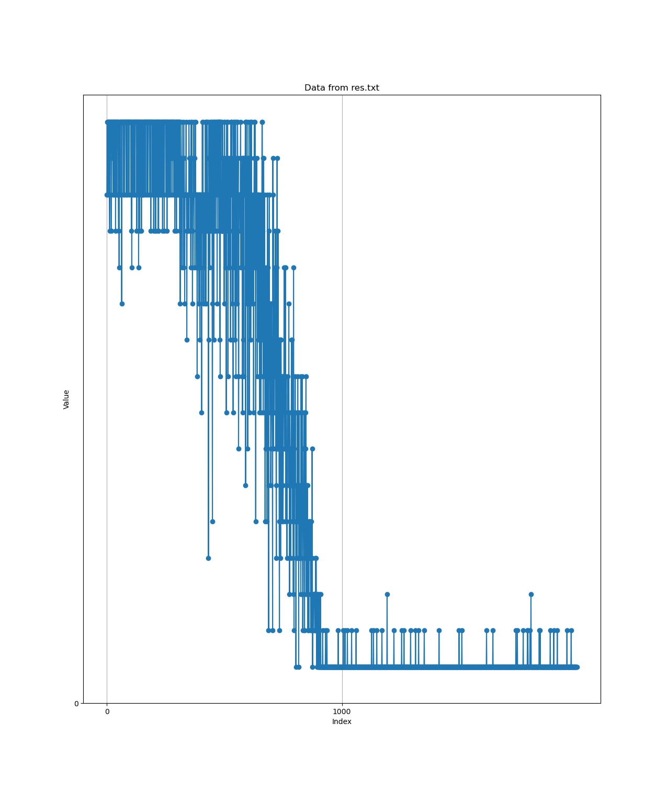

# Record for current experiments for runahead execution
## Execution window
We assume the runahead execution window should be much larger than reorder buffer. It is nice to learn about what is the approximate size of the execution window.
### Hypothesis
The execution window should be much larger than spectre execution.
### Experiment design
We may design a experiment to measure the execution window size of runahead. As shown in the following code, multiple `nop` instruction is inserted before the reload operation. In this case, we are able to see how many `nop` are we able to insert, but make sure we still able to leak the data in secret. 

```
static inline __attribute__((always_inline)) void spectre_v1( size_t index) {
	/*
	 * Spectre v1 runahead
	 */
	if (index < size)
	{	
		#ifdef N
			NOPS(N);                    // keep changing the number of nop
		#endif
		pick = reloadbuffer[fake_buffer[index] << 12];
	}
}

```

```
/*Check how many bytes are correctly leaked*/
int correct = 0;
	for(int i = 0; i < 16; i++){
		if(leaked[i] == secret[i]){
			correct ++;
		}
	}

```
### Result
The size of `secret` is 16, and we see the number of bytes leaked correctly is keep decreasing. (Since we know `nop` will be optimized by DCO, from the figure, it's very possible DCO is not triggered.)

In the figure, x-axis means the number of `nop` we insert, y-axis means how any bytes are leaked correctly.


### Discussion 
Using this experiment, it seems we are not able to get the precise size of execution window. But we may infer that the execution window may be around 800.

How to get the precise size of execution window?
1. With DCO, we are not able to use more iterations, but we only use 200 iterations to leak the secret, we can use more.
2. There are some tricks to add more latencies to fetch `size` into cache.
    
    Chaining: 
   ```
    unsigned int *index_p1 = &size;
    unsigned int **index_p2 = &index_p1;
    unsigned int ***index_p3 = &index_p2;
    // then flush all of the pointer
   ```
3. Is the execution window size fixed? Does it depend on the latency for the CPU to get `size`. If we use chaining, maybe it is possible to see a larger execution window.
   


